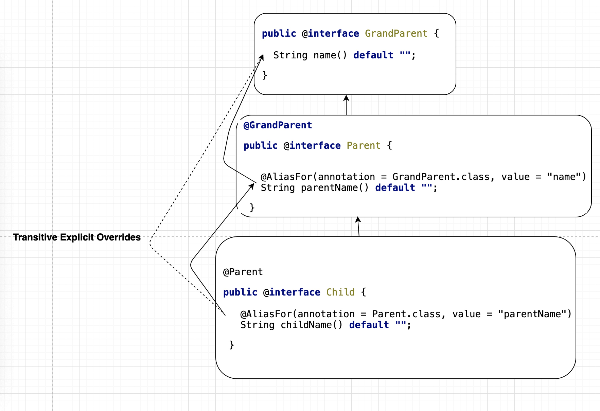

# 理解 Spring 注解编程模型
  Spring 中有一个概念叫「元注解」(Meta-Annotation)，通过元注解，实现注解的「派生性」，官方的说法是「Annotation Hierarchy」。

## 什么是元注解
  所谓元注解，即标注在注解上的注解。这种方式所形成的注解层级结构中，元注解在层级结构的上面。
  引入元注解的目的是为了实现属性覆盖(Attribute Override) 的目的。

  举个简单的例子：  
  有 一个类 Home 和 2 个注解，1 个叫 @Parent，另一个叫 @Child ，@Parent 标注在 @Child 上，@Child 标注在 Home 上，它们都只有一个属性，叫 name，
如果 @Parent.name 的默认值是 'John'，而 @Child.name 的默认值是 'Jack'。  

  这时，从 Home 上获取 @Child.name，应该返回 'Jack'，这毫无悬念。  
  
  那么，如果获取 @Parent.name，应该返回什么呢？根据 Spring 注解的「派生性」，@Child.name override @Parent.name，所以返回结果也是 'Jack'。

  上述例子中的类和注解，代码大致如下
```java
@interface Parent {
    String name() default "John";
}

@Parent
@interface Child {
    String name() default "Jack";
}

@Child
class Home { }
```
  
  注解层级结构：
```text
@Parent
    @Child
```

代码验证： [Sample1](https://github.com/justmehyp/note-spring-boot/blob/master/code/annotation-attribute/src/test/java/example/springframework/sample1/Home.java)


  相对于「属性覆盖」，还有另一个概念是「属性别名」(Alias)，属性别名之间是互相等价的。  
  
  我们给上面的 @Child 加一个属性 value，并且使用 @AliasFor ，使 @Child.name 和 @Child.value 互相成为别名，并且默认值为空字符串：
```java
@interface Child {
    @AliasFor("name")
    String value() default "";
 
    @AliasFor("value")
    String name() default "";
}
```
标注在 Home 上时，给 @Child.value 设置值为 "Jack":
```java
@Child("Jack")
class Home { }
```
  这时，无论是获取 @Child.name 还是获取 @Child.value，其结果总是相同的，都是 "Jack"。说明了属性别名之间的等价性。
  
代码验证： [Sample2](https://github.com/justmehyp/note-spring-boot/blob/master/code/annotation-attribute/src/test/java/example/springframework/sample2/Home.java)


## 属性别名 和 属性覆盖
属性别名 和 属性覆盖 其实是两个完全不同的概念，但是如果不加区分，模糊概念的话，就会对一些现象不符合预期而感到意外。
考虑以下案例，分别给出从 Sample3 获取到 @A.a1、@A.a2、@B.a1、@B.b、@C.c、@C.b 的值：
```java

@C
class Sample3 { }

@interface A {
    String a1() default "1";
    String a2() default "1";
}

@A
@interface B {
    String a1() default "2";
    
    @AliasFor(value = "a2", annotation = A.class)
    String b() default "2";
}

@B
@interface C {
    @AliasFor(value = "a1", annotation = B.class)   
    String c() default "3";

    String b() default "3";
}
```

在我没有弄清概念之前，我觉得答案应该是：@A.a1、@A.a2、@B.a1、@B.b、@C.c、@C.b 全都是 "3"。  
理由如下：  
- @C.c 是 @B.a1 的别名，@B.a1 覆盖 @A.a1 ，所以这 3 者是一条链上的，它们的值应该相等, 是 "3"。
- @C.b 覆盖 @B.b，@B.b 是 @A.a2 的别名，所以这 3 者 也是一条链上的，它们的值也应该相等，是 "3"。  

而结果却是，我错了，@B.a1、@B.b、@C.c、@C.b 的值是 "3"， 但 @A.a1、@A.a2 的值是 "2"。  
至于为什么，我们先来认真理解一下 属性别名 和 属性覆盖 这 2 个概念吧。

援引官方 Wiki `https://github.com/spring-projects/spring-framework/wiki/Spring-Annotation-Programming-Model`,
其中有关于这两个概念的澄清。在 「Attribute Aliases and Overrides」 一节中，官方原文如下(为了方便理解，我画了图)：

An **attribute alias** is an alias from one annotation attribute to another annotation attribute. 
Attributes within a set of aliases can be used interchangeably and are treated as equivalent. 
Attribute aliases can be categorized as follows.

1) Explicit Aliases: if two attributes in one annotation are declared as aliases for each other via @AliasFor, they are explicit aliases.  

2) Implicit Aliases: if two or more attributes in one annotation are declared as explicit overrides for the 
same attribute in a meta-annotation via @AliasFor, they are implicit aliases.  

3) Transitive Implicit Aliases: given two or more attributes in one annotation that are declared as explicit overrides 
for attributes in meta-annotations via @AliasFor, if the attributes effectively override the same attribute 
in a meta-annotation following the law of transitivity, they are transitive implicit aliases.  


An **attribute override** is an annotation attribute that overrides (or shadows) an annotation attribute in a meta-annotation. 
Attribute overrides can be categorized as follows.

1) Implicit Overrides: given attribute A in annotation @One and attribute A in annotation @Two, if @One is 
meta-annotated with @Two, then attribute A in annotation @One is an implicit override for attribute A in annotation 
@Two based solely on a naming convention (i.e., both attributes are named A).  


2) Explicit Overrides: if attribute A is declared as an alias for attribute B in a meta-annotation via @AliasFor, 
then A is an explicit override for B.  


3) Transitive Explicit Overrides: if attribute A in annotation @One is an explicit override for attribute B in 
annotation @Two and B is an explicit override for attribute C in annotation @Three, then A is a transitive explicit 
override for C following the law of transitivity.  


属性别名，有 3 种， 分别是 显式别名，隐式别名 和 传递隐式别名, 「属性别名」 只能发生在同一个注解内部。比如：  

显式别名(互相@AliasFor)，@A.a1 和 @A.a2， 
```java
@interface A {
    @AliasFor("a2")
    String a1() default "";

    @AliasFor("a1")
    String a2() default "";
}
```

隐式别名(@AliasFor到同一个属性)，@B.b1 和 @B.b2
```java
@interface A {
    String a() default "";
}

@A
@interface B {
    @AliasFor(value = "a", annotation = A.class)
    String b1() default "";

    @AliasFor(value = "a", annotation = A.class)
    String b2() default "";
}
```

传递隐式别名(最终@AliasFor到同一个属性) @C.c1 和 @C.c2
```java
@interface A {
    String a() default "";
}

@A
@interface B {
    @AliasFor(value = "a", annotation = A.class)
    String b() default "";
}

@B
@interface C {
    @AliasFor(value = "a", annotation = A.class)
    String c1() default "";

    @AliasFor(value = "b", annotation = B.class)
    String c2() default "";
}
```

属性覆盖，也有 3 种，分别是 隐式覆盖，显式覆盖 和 传递显式覆盖，「属性覆盖」只能发生在注解之间。比如：  

隐式覆盖(同名属性)， @B.a 覆盖 @A.a
```java
@interface A {
    String a() default "";
}

@A
@interface B {
    String a() default "";
}
```

显式覆盖(需要@AliasFor)，@B.b 覆盖 @A.a
```java
@interface A {
    String a() default "";
}

@A
@interface B {
    @AliasFor(value = "a", annotation = A.class)
    String b() default "";
}
```

传递显式覆盖(需要 @AliasFor)，由于 @C.c 覆盖  @B.b， @B.b 覆盖 @A.a， 所以 @C.c 也 覆盖 @A.a
```java
@interface A {
    String a() default "";
}

@A
@interface B {
    @AliasFor(value = "a", annotation = A.class)
    String b() default "";
}

@B
@interface C {
    @AliasFor(value = "b", annotation = B.class)
    String c() default "";
}
```

理解清楚之后，我们回到刚才的题目，样例重贴如下：
```java
@interface A {
    String a1() default "1";

    String a2() default "1";
}

@A
@interface B {
    String a1() default "2";
    
    @AliasFor(value = "a2", annotation = A.class)
    String b() default "2";
}

@B
@interface C {
    @AliasFor(value = "a1", annotation = B.class)   
    String c() default "3";

    String b() default "3";
}
```
解答步骤是：
- 对于注解 @C，@C.c = "3", @C.b = "3"  
- 对于注解 @B, @B.a1 被 @C.c 显式覆盖, 所以 @B.a1 = @C.c = "3"； @B.b 被 @C.b 隐式覆盖，所以 @B.b = @C.b = "3"
- 对于注解 @A, @A.a1 被 @B.a1 隐式覆盖，所以 @A.a1 = @B.a1 = "2"; @A.a2 被 @B.b 显式覆盖，所以 @A.a2 = @B.b = "2"

可以看到 @A 和 @C 之间没有任何关系。这里也根本没有「属性别名」的存在，不是用了 @AliasFor 就是 「属性别名」的。  
对于「显式传递覆盖」，像上面 "@A.a1 被 @B.a1 隐式覆盖， @B.a1 被 @C.c 显式覆盖"，或者 "@A.a2 被 @B.b 显式覆盖， B.b 被 @C.b 隐式覆盖"， 覆盖关系是不会传递的。

代码验证：[Sample3](https://github.com/justmehyp/note-spring-boot/blob/master/code/annotation-attribute/src/test/java/example/springframework/sample3/Sample3.java)

## 总结
属性别名，有 3 种， 分别是 显式别名，隐式别名 和 传递隐式别名, 「属性别名」 只能发生在同一个注解内部。
属性覆盖，也有 3 种，分别是 隐式覆盖，显式覆盖 和 传递显式覆盖，「属性覆盖」只能发生在注解之间。

## 后记
Spring 对于注解编程模型的代码实现，主要在 AnnotatedElementUtils 这个类中，做试验可以使用这个方法：AnnotatedElementUtils#getMergedAnnotationAttributes。  

需要注意的是，「隐式覆盖」不适用于 value 属性，貌似 value 属性是一个相对特殊的属性。

以下示例， @B.value 不会 隐式覆盖 @A.value
```java
@interface A {
    String value() default "a";
}

@A
@interface B {
    String value() default "b";
}
```

但只要属性名不是 value，都可以 隐式覆盖 , @B.xxx 隐式覆盖 @A.xxx
```java
@interface A {
    String xxx() default "a";
}

@A
@interface B {
    String xxx() default "b";
}
```

我跟了以下源码，发现源码中确实对 value 属性做了特殊判断，代码位置在 
`org.springframework.core.annotation.AnnotatedElementUtils.MergedAnnotationAttributesProcessor#postProcess` 方法中，代码片段如下；
```text
    // Implicit annotation attribute override based on convention
    else if (!AnnotationUtils.VALUE.equals(attributeName) && attributes.containsKey(attributeName)) {
        overrideAttribute(element, annotation, attributes, attributeName, attributeName);
    }
```
其中，AnnotationUtils.VALUE 是一个常量，其值为 "value"。暂时没有找到官方说明为什么要对 value 属性做特殊处理。猜测是很多注解只有一个属性，
为了编程方便，因为不需要 @A(value = "hello world) 这样使用， 只需要 @A("hello world") 即可。这种情况下，如果隐式覆盖，可能不是编码者想要的结果。

值得一提的是，显式覆盖 没有这种特殊处理，以下示例 @B.value 会显式覆盖 @A.value:
```java
@interface A {

    String value() default "a";
}

@A
@interface B {

    @AliasFor(annotation = A.class)
    String value() default "b";
}
```

可以发现，Spring 注解：@Repository、@Service、@Controller、@Configuration 等 @Component 的'派生'注解, value 属性都用了 
@AliasFor(annotation = Component.class)，从侧面反映出 value 不支持隐式覆盖，否则 Spring 官方也不会多此一举。  

本文讨论所涉及的 Spring Boot 版本 >= 2.0.2.RELEASE。
 